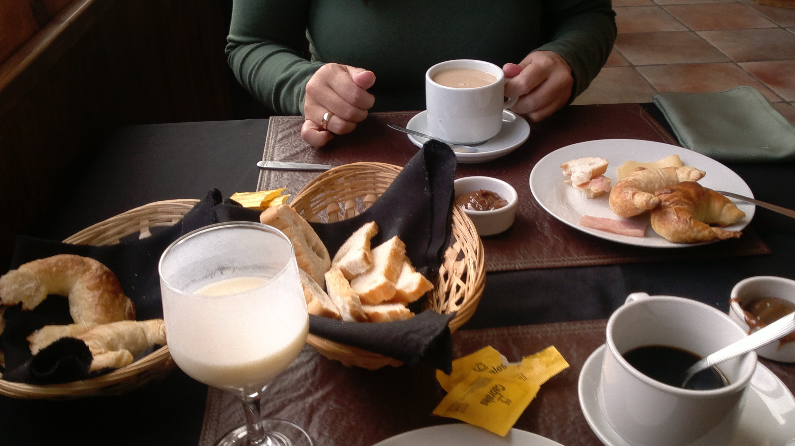
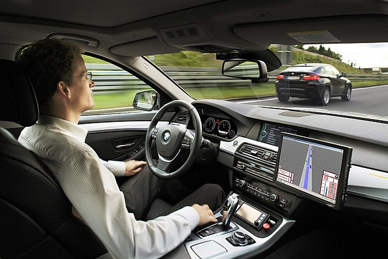

# Image Captioning
Image Captioning is a neural network based on the [Show, Attend and Tell: Neural Image Caption Generation with Visual Attention](https://arxiv.org/abs/1502.03044). Instead of using a LSTM as RNN, the implementation uses a GRU. The code is based on the Tensorflow implementation of a GRUCell and the [Tensorflow tutorial](https://www.tensorflow.org/tutorials/text/image_captioning#preprocess_and_tokenize_the_captions).

## Requirements
This code has been tested with Tensorflow 2.1.0 and 2.3.0

## Files:

* download.py: it downloads the training dataset. This step is required before training.
* preprocess_data.py: it preprocesses the training dataset. It extract the image feautres using the keras pretrained InceptionV3 NN. This step is required before training.
* trainModel.py. it trains a model for 10 epochs. It might be enough for the first training, but I would recommend to train it at least for 30 epochs. Further fine-tuning could be applied. It generates a tokenizer.pickle file, for tokenize the string captions, and a model file per each training epoch.
* showAndTell.py: it is not an executable, it defines the GRURecurrent layer.
* captionPict.py: it generates captions for a list of pictures using a given model using beam search. By default, the beam search is of width 3 and the maximum length of the generated captions is 20. 

```
python captionPict.py -m model.h5 -p pict1.jpg pict2.jpg ... pictN.jpg
```
## Pretrained model

A pre-trained model is available at [this link](https://mega.nz/file/M5Z0ADgR#468oecjFSxN1fc875vt5KLDqmzI8dNtecTPuW72A4Nc). 

## Examples

This section presents images and 3 proposed captions, with the probability of each word given the previous words. Tags \<start\> and \<end\> represent start and end of the proposed caption. Tag <pad> should be ignored.
  
This captions were generated using the pretrained model linked above. This shows that the model is not perfect, but it works reasonably well.


\<start\> a woman is holding a cup of coffee \<end\> \<pad\> \<pad\> \<pad\> \<pad\> \<pad\> \<pad\> \<pad\> \<pad\> \<pad\> \<pad\>

[1, 0.6610868, 0.70698476, 0.19650316, 0.3221932, 0.89829737, 0.24611072, 0.7671166, 0.67664224, 0.3304092]

\<start\> a woman is holding a cup of coffee and smiling \<end\> \<pad\> \<pad\> \<pad\> \<pad\> \<pad\> \<pad\> \<pad\> \<pad\>

[1, 0.6610868, 0.70698476, 0.19650316, 0.3221932, 0.89829737, 0.24611072, 0.7671166, 0.67664224, 0.4264504, 0.15117, 0.7488365]

\<start\> a woman is holding a cup of coffee and a green flower \<end\> \<pad\> \<pad\> \<pad\> \<pad\> \<pad\> \<pad\>

[1, 0.6610868, 0.70698476, 0.19650316, 0.3221932, 0.89829737, 0.24611072, 0.7671166, 0.67664224, 0.4264504, 0.3840825, 0.22809173, 0.13712825, 0.66556877]



\<start\> a person holding a plate of food on a table with a cup of coffee \<end\> \<pad\> \<pad\> \<pad\>

[1, 0.76346123, 0.39404222, 0.17821132, 0.8345991, 0.17279796, 0.6531335, 0.7160085, 0.3109737, 0.5403981, 0.9098033, 0.13172844, 0.48399276, 0.68342793, 0.9377165, 0.98804945, 0.6763985]

\<start\> a person holding a plate of food on a table \<end\> \<pad\> \<pad\> \<pad\> \<pad\> \<pad\> \<pad\> \<pad\> \<pad\>

[1, 0.76346123, 0.39404222, 0.17821132, 0.8345991, 0.17279796, 0.6531335, 0.7160085, 0.3109737, 0.5403981, 0.9098033, 0.566928]

\<start\> a person holding a tray of food on a table \<end\> \<pad\> \<pad\> \<pad\> \<pad\> \<pad\> \<pad\> \<pad\> \<pad\>

[1, 0.76346123, 0.39404222, 0.17821132, 0.8345991, 0.16815804, 0.80100155, 0.6098093, 0.31803954, 0.48226732, 0.75926733, 0.65134495]



\<start\> a woman is looking out the window of a car \<end\> \<pad\> \<pad\> \<pad\> \<pad\> \<pad\> \<pad\> \<pad\> \<pad\>

[1, 0.506435, 0.21487351, 0.28649873, 0.49503404, 0.48345146, 0.479223, 0.6992989, 0.7948463, 0.84353256, 0.62499845, 0.88119674]

\<start\> a man is looking out the window of a car \<end\> \<pad\> \<pad\> \<pad\> \<pad\> \<pad\> \<pad\> \<pad\> \<pad\>

[1, 0.506435, 0.24583736, 0.2673721, 0.4316258, 0.32670817, 0.4739727, 0.793706, 0.8257773, 0.84117657, 0.6488962, 0.8336398]

\<start\> a man is looking out the window of a vehicle \<end\> \<pad\> \<pad\> \<pad\> \<pad\> \<pad\> \<pad\> \<pad\> \<pad\>

[1, 0.506435, 0.24583736, 0.2673721, 0.4316258, 0.32670817, 0.4739727, 0.793706, 0.8257773, 0.84117657, 0.25643656, 0.84937686]


\<start\> a large body of water with a mountain in the background \<end\> \<pad\> \<pad\> \<pad\> \<pad\> \<pad\> \<pad\> \<pad\>

[1, 0.6116378, 0.12835293, 0.15447237, 0.9956559, 0.9852542, 0.39252746, 0.44148406, 0.54093957, 0.3241263, 0.88203025, 0.9195079, 0.9597962]

\<start\> a large body of water with a mountain view \<end\> \<pad\> \<pad\> \<pad\> \<pad\> \<pad\> \<pad\> \<pad\> \<pad\> \<pad\>

[1, 0.6116378, 0.12835293, 0.15447237, 0.9956559, 0.9852542, 0.39252746, 0.44148406, 0.54093957, 0.10874715, 0.52894074]

\<start\> a large body of water with a mountain in the background and a cloud beyond \<end\> \<pad\> \<pad\> \<pad\>

[1, 0.6116378, 0.12835293, 0.15447237, 0.9956559, 0.9852542, 0.39252746, 0.44148406, 0.54093957, 0.3241263, 0.88203025, 0.9195079, 0.015790248, 0.2362503, 0.22257425, 0.7397072, 0.79420984]
